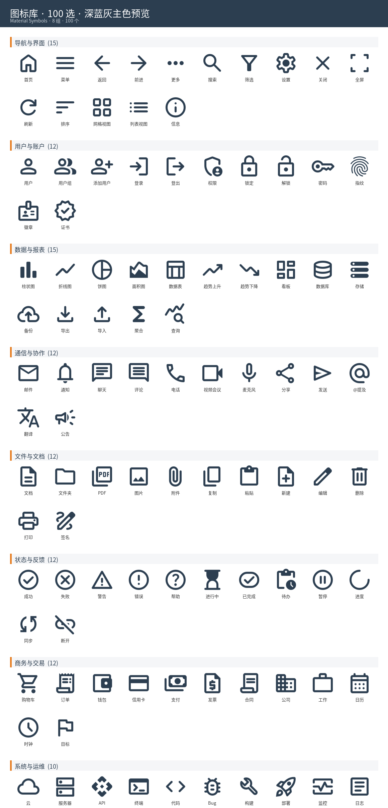
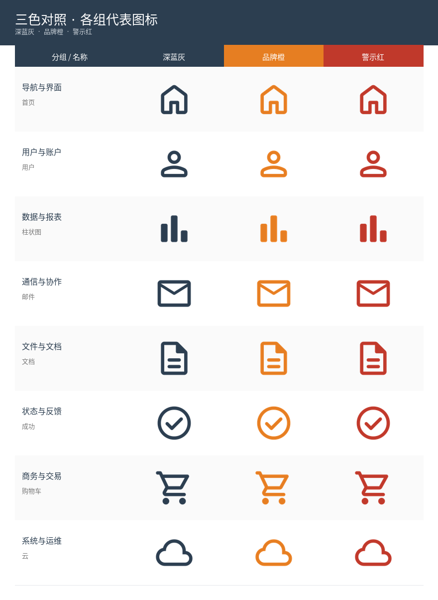

# 图标库 · 100 选 · 三色对照 · 矢量版

精选 100 个 Material Symbols **outline 风格**图标(线框,改色只染线条),按 8 大业务场景分组,每图渲染 3 色 SVG/PNG。粘到文档里**不会出现填色方框**,在 PowerPoint 2016+ 里还能直接矢量改色。

## 交付产物

| 文件 | 说明 | 大小 |
| --- | --- | --- |
| [`assets/svg/`](./assets/svg/) | **300 个 SVG 矢量文件**,按颜色分目录,文件名 `NN_中文名.svg`,可直接拖进 PPT/Word/Figma | 300 个 |
| [`assets/icon_library.xlsx`](./assets/icon_library.xlsx) | 每行 1 个图标,内嵌 3 色缩略图 + 编号/中文名/分组/Iconify ID | ~1.1 MB |
| [`assets/icon_library.pptx`](./assets/icon_library.pptx) | **PPT 内嵌 SVG 矢量**(2016+),封面 + 8 组分页(一页 12 图)+ 三色对照页,共 12 页 | ~700 KB |
| [`assets/preview_grid.png`](./assets/preview_grid.png) | 100 图网格预览 | ~330 KB |
| [`assets/preview_tricolor.png`](./assets/preview_tricolor.png) | 各组代表图标的三色对照 | ~107 KB |

### 网格预览(深蓝灰主色,outline 风格)



### 三色对照



## 怎么用

### 1. 最理想:拖 SVG 进文档

PowerPoint 2016+ / Word 2016+ / Notion / Figma / Sketch 都原生支持 SVG。

```text
assets/svg/blue/01_首页.svg     # 深蓝灰
assets/svg/orange/01_首页.svg   # 品牌橙
assets/svg/red/01_首页.svg      # 警示红
```

直接把 SVG 文件拖到 PPT 幻灯片里,**不会有方框**。在 PPT 里右键 → 转换为形状,可以无损改色、放大不糊。

### 2. 已经做好的 PPTX(打开就能用)

打开 `assets/icon_library.pptx`,每个图标都是**矢量**:
- 选中图标 → 右键 → 图片格式 → 颜色 → 重新着色,可以一键改色
- 放大不会糊
- 老版 PowerPoint / WPS 自动用 PNG 兜底,显示正常但不能矢量改色

### 3. Excel 速查表

打开 `assets/icon_library.xlsx`,每行有图标的三色缩略图 + 中文名 + Iconify ID。
找到要的图标,记下 Iconify ID,再去 `assets/svg/{颜色}/` 找对应文件用。

## 设计要点

- **图标风格**:Material Symbols **outline-rounded**(线框圆角)。改色只染线条,中间留白透明,粘到文档不会填满方框。
- **三色方案**:
  - 深蓝灰 `#2C3E50` — 主用色
  - 品牌橙 `#E67E22` — 强调色
  - 警示红 `#C0392B` — 警示色
- **8 大分组共 100 图**:导航与界面 15 · 用户与账户 12 · 数据与报表 15 · 通信与协作 12 · 文件与文档 12 · 状态与反馈 12 · 商务与交易 12 · 系统与运维 10
- **PPTX 真矢量**:每张图同时嵌入 PNG(兜底)+ SVG(矢量主体),PowerPoint 2016+ 优先显示 SVG

## 重新构建

```bash
python3 -m venv .venv
.venv/bin/pip install openpyxl python-pptx Pillow cairosvg requests lxml

# 1. 拉取 SVG,渲染 100 图 × 3 色 (PNG 进 build/, SVG 进 assets/svg/)
.venv/bin/python scripts/render.py

# 2. Excel(用 PNG 缩略图)
.venv/bin/python scripts/build_xlsx.py

# 3. PPTX(嵌入 SVG 矢量 + PNG 兜底)
.venv/bin/python scripts/build_pptx.py

# 4. 静态预览图(可选,需要中文字体: dnf install google-noto-sans-cjk-fonts)
.venv/bin/python scripts/build_preview.py
```

切换风格只需改 `scripts/icons.py` 顶部的 `STYLE`(目前是 `outline-rounded`,可选 `filled-rounded`)。

## 数据来源

- 图标:[Material Symbols](https://github.com/google/material-design-icons)(Apache 2.0),通过 [Iconify API](https://iconify.design/docs/api/) 拉取
- 字体(预览图渲染):Noto Sans CJK
